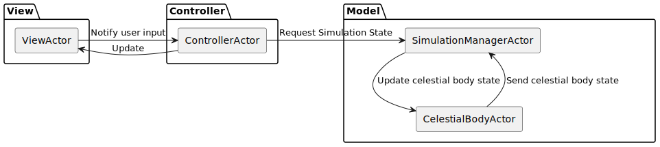
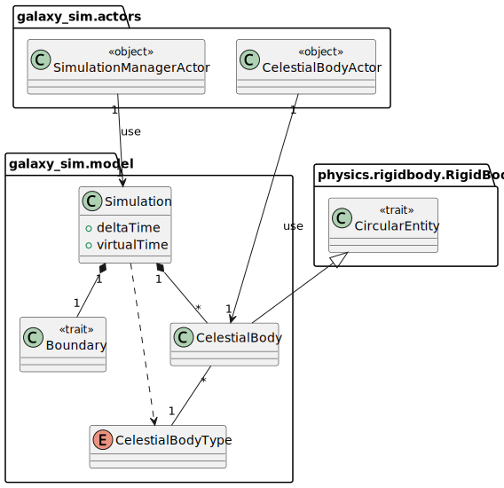
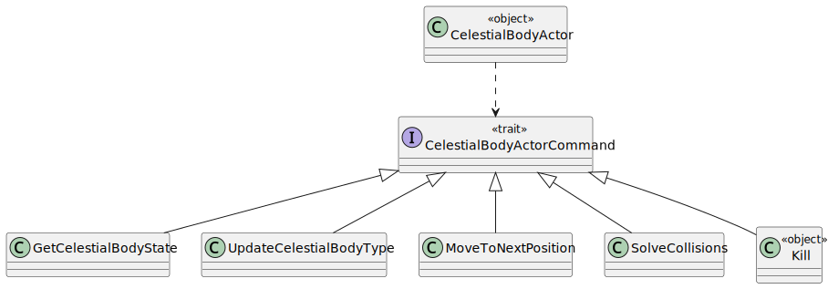
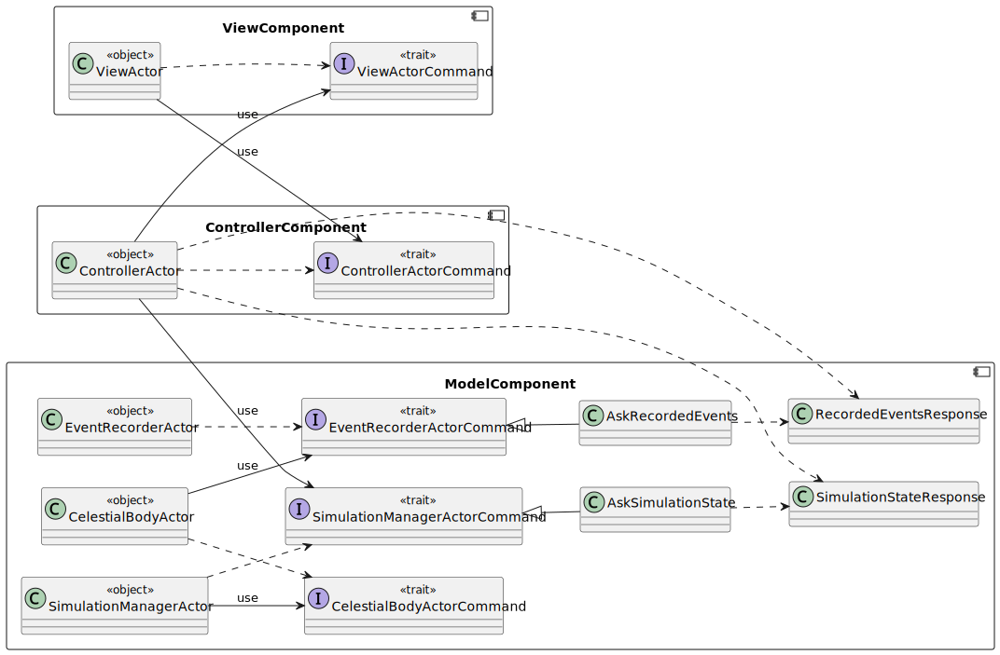
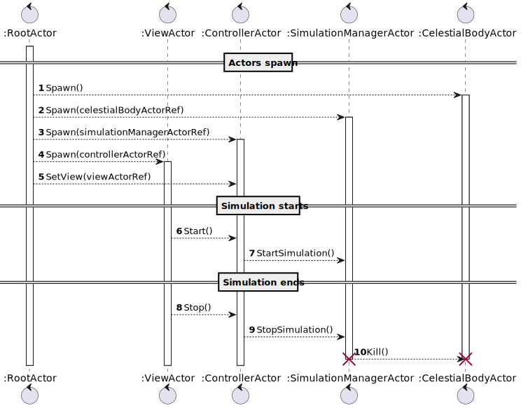
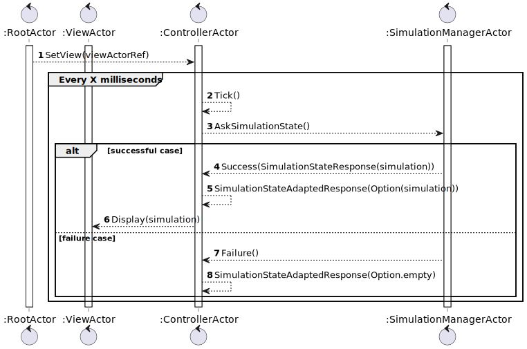
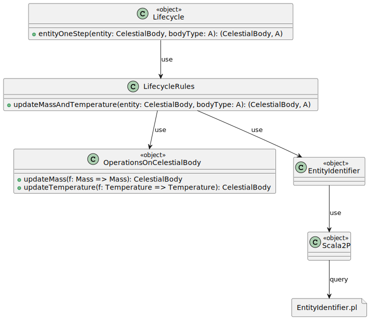
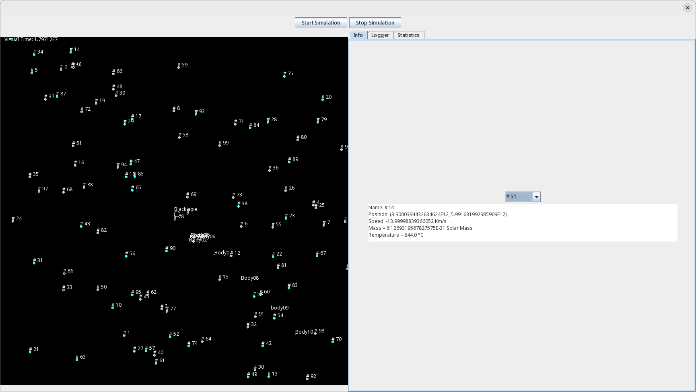
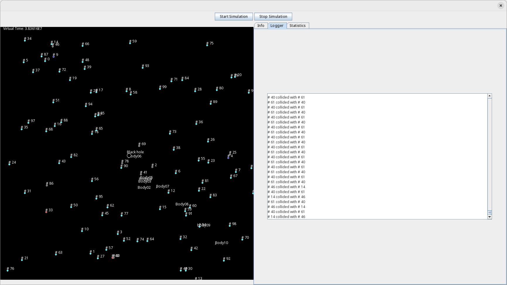
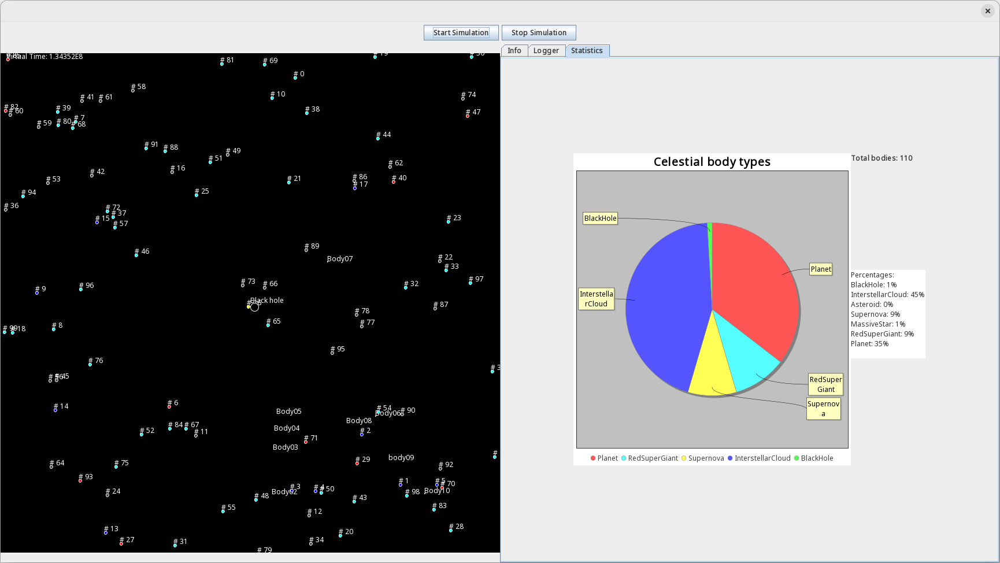

# Introduzione

Galaxy Simulator è un simulatore del moto dei corpi all’interno di una galassia. Permette di vedere l’interazione che c’è tra varie tipologie di corpi celesti mentre orbitano attorno a un corpo principale posto al centro della galassia

---

# Funzionalità di base

- Rappresentazione 2D della simulazione
- Presenza di diversi tipi di corpi celesti
- Visualizzazione del movimento dei corpi celesti
- Visualizzazione delle informazioni dei corpi presenti durante la simulazione
- Visualizzazione di statistiche generali sulla simulazione
- Modifica delle caratteristiche di un corpo con il passare del tempo e con le collisioni
---

# Architettura del sistema

---

# Simulazione: design

---

# Simulazione: loop

Step eseguiti durante un'iterazione:

1. Aggiornamento del tipo dei corpi
2. Aggiornamento della posizione dei corpi
3. Risoluzione delle collisioni

---

# Attori: introduzione

- CelestialBodyActor: gestisce un corpo celeste
- SimulationManagerActor: gestisce la simulazione
- EventRecorderActor: registra gli eventi
- ControllerActor: gestisce la parte di Controller
- ViewActor: gestisce la View della simulazione

---

# Attori: design

---

# Attori: design

---

# Attori: ciclo di vita

---

# Attori: loop della simulazione

---

# Attori: aggiornamento della View

---

# Identificazione delle entità
Massa e Temperatura definiscono il tipo di entità:

- **Asteroide**: Temp <= 50
- **Pianeta**: 50 < Temp <= 100
- **Nube Interstellare**: 100 < Temp <= 1000
- **Massive star**: (Temp > 1000) && (0 <= Massa < 1e10) 
- **Red super giant**: (Temp > 1000) && (1e10 <= Massa < 1e20) 
- **Supernova**: (Temp > 1000) && (1e20 <= Massa < 1e30) 
- **Black hole**: (Temp > 1000) && (Massa >= 1e30) 

---

# Ciclo di vita

---

# Fisica: dynamics

- PhysicalEntity: il soggetto su cui vengono applicate le leggi gravitazionali, con i relativi attributi fisici;
- GravitationLaws: la logica per calcolare le formule gravitazionali, tra cui attrazione gravitazionale, velocità e nuova posizione.

---
# Fisica: collisions

- Intersection: logica per controllare se due corpi stanno collidendo, basandosi sull' intersezione di bounding boxes;
- Impact: logica per esprimere il risultato di una collisione;

---
# Fisica: rigidbody

- Riunisce concetti della fisica: una PhysicalEntity con CollisionBox;

---

# GUI: Info

---

# GUI: Log

---

# GUI: Statistiche

