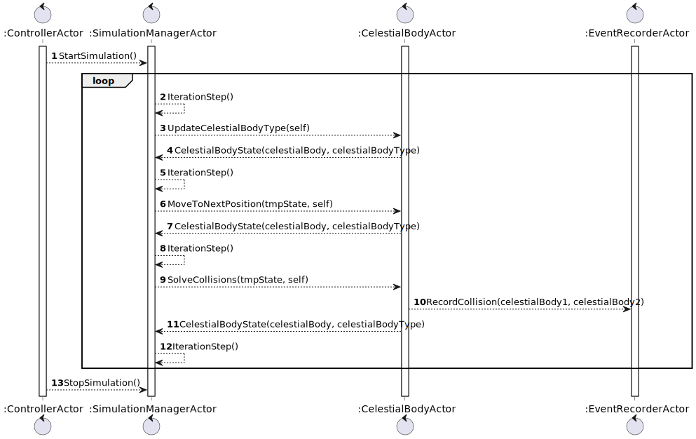

# **Introduzione**

---

# **Requisiti**

___

# **Architettura**

---

### **Attori**

---

### **Attori: ciclo di vita**

---

### **Attori: loop della simulazione**

---

### **Attori: aggiornamento della View**

---

# **Ciclo di vita**

___

# **Fisica**

___

### **GUI: Info**

___

### **GUI: Log**

___

### **GUI: Statistiche**

